------------------------------------------------------------------------

# Unit 1: R for Data Mining

## 1.1 Introduction to Modern Data Mining

### Load & Inspect the Dataset

``` r
df = read.csv("customer_churn.csv", stringsAsFactors = FALSE)

cat("Dataset Dimensions:", nrow(df), "rows ×", ncol(df), "columns\n")
```

    ## Dataset Dimensions: 10000 rows × 12 columns

``` r
head(df,10)
```

    ##    CustomerID Gender SeniorCitizen Partner Dependents Tenure PhoneService
    ## 1   CUST00001   Male             0      No         No     65          Yes
    ## 2   CUST00002   Male             0      No         No     26          Yes
    ## 3   CUST00003   Male             0     Yes         No     54          Yes
    ## 4   CUST00004 Female             0     Yes        Yes     70          Yes
    ## 5   CUST00005   Male             0      No         No     53          Yes
    ## 6   CUST00006 Female             0      No        Yes     45          Yes
    ## 7   CUST00007 Female             0     Yes         No     35          Yes
    ## 8   CUST00008 Female             0     Yes        Yes     20          Yes
    ## 9   CUST00009 Female             0     Yes        Yes     48           No
    ## 10  CUST00010 Female             0      No         No     33          Yes
    ##    InternetService       Contract MonthlyCharges TotalCharges Churn
    ## 1      Fiber optic Month-to-month          20.04      1302.60    No
    ## 2      Fiber optic Month-to-month          65.14      1693.64    No
    ## 3      Fiber optic Month-to-month          49.38      2666.52    No
    ## 4              DSL       One year          31.19      2183.30    No
    ## 5              DSL Month-to-month         103.86      5504.58   Yes
    ## 6      Fiber optic Month-to-month          87.34      3930.30   Yes
    ## 7               No       One year         119.91      4196.85   Yes
    ## 8      Fiber optic Month-to-month          69.84      1396.80   Yes
    ## 9               No Month-to-month          53.07      2547.36    No
    ## 10              No       Two year          46.38      1530.54    No

``` r
str(df)
```

    ## 'data.frame':    10000 obs. of  12 variables:
    ##  $ CustomerID     : chr  "CUST00001" "CUST00002" "CUST00003" "CUST00004" ...
    ##  $ Gender         : chr  "Male" "Male" "Male" "Female" ...
    ##  $ SeniorCitizen  : int  0 0 0 0 0 0 0 0 0 0 ...
    ##  $ Partner        : chr  "No" "No" "Yes" "Yes" ...
    ##  $ Dependents     : chr  "No" "No" "No" "Yes" ...
    ##  $ Tenure         : int  65 26 54 70 53 45 35 20 48 33 ...
    ##  $ PhoneService   : chr  "Yes" "Yes" "Yes" "Yes" ...
    ##  $ InternetService: chr  "Fiber optic" "Fiber optic" "Fiber optic" "DSL" ...
    ##  $ Contract       : chr  "Month-to-month" "Month-to-month" "Month-to-month" "One year" ...
    ##  $ MonthlyCharges : num  20 65.1 49.4 31.2 103.9 ...
    ##  $ TotalCharges   : num  1303 1694 2667 2183 5505 ...
    ##  $ Churn          : chr  "No" "No" "No" "No" ...

``` r
missing_summary = data.frame(
  Variable     = names(df),
  Type         = sapply(df, class),
  Missing      = sapply(df, function(x) sum(is.na(x))),
  Missing_Pct  = round(sapply(df, function(x) mean(is.na(x))) * 100, 2),
  Unique_Values = sapply(df, function(x) length(unique(x)))
)

kable(missing_summary, row.names = FALSE,
      caption = "Table 1: Variable dictionary with missing value audit") %>%
  kable_styling(bootstrap_options = c("striped", "hover", "condensed"),
                full_width = FALSE) %>%
  column_spec(3, color = ifelse(missing_summary$Missing > 0, "red", "green"))
```

<table class="table table-striped table-hover table-condensed" style="color: black; width: auto !important; margin-left: auto; margin-right: auto;">

<caption>

Table 1: Variable dictionary with missing value audit
</caption>

<thead>

<tr>

<th style="text-align:left;">

Variable
</th>

<th style="text-align:left;">

Type
</th>

<th style="text-align:right;">

Missing
</th>

<th style="text-align:right;">

Missing_Pct
</th>

<th style="text-align:right;">

Unique_Values
</th>

</tr>

</thead>

<tbody>

<tr>

<td style="text-align:left;">

CustomerID
</td>

<td style="text-align:left;">

character
</td>

<td style="text-align:right;color: green !important;">

0
</td>

<td style="text-align:right;">

0
</td>

<td style="text-align:right;">

10000
</td>

</tr>

<tr>

<td style="text-align:left;">

Gender
</td>

<td style="text-align:left;">

character
</td>

<td style="text-align:right;color: green !important;">

0
</td>

<td style="text-align:right;">

0
</td>

<td style="text-align:right;">

2
</td>

</tr>

<tr>

<td style="text-align:left;">

SeniorCitizen
</td>

<td style="text-align:left;">

integer
</td>

<td style="text-align:right;color: green !important;">

0
</td>

<td style="text-align:right;">

0
</td>

<td style="text-align:right;">

2
</td>

</tr>

<tr>

<td style="text-align:left;">

Partner
</td>

<td style="text-align:left;">

character
</td>

<td style="text-align:right;color: green !important;">

0
</td>

<td style="text-align:right;">

0
</td>

<td style="text-align:right;">

2
</td>

</tr>

<tr>

<td style="text-align:left;">

Dependents
</td>

<td style="text-align:left;">

character
</td>

<td style="text-align:right;color: green !important;">

0
</td>

<td style="text-align:right;">

0
</td>

<td style="text-align:right;">

2
</td>

</tr>

<tr>

<td style="text-align:left;">

Tenure
</td>

<td style="text-align:left;">

integer
</td>

<td style="text-align:right;color: green !important;">

0
</td>

<td style="text-align:right;">

0
</td>

<td style="text-align:right;">

72
</td>

</tr>

<tr>

<td style="text-align:left;">

PhoneService
</td>

<td style="text-align:left;">

character
</td>

<td style="text-align:right;color: green !important;">

0
</td>

<td style="text-align:right;">

0
</td>

<td style="text-align:right;">

2
</td>

</tr>

<tr>

<td style="text-align:left;">

InternetService
</td>

<td style="text-align:left;">

character
</td>

<td style="text-align:right;color: green !important;">

0
</td>

<td style="text-align:right;">

0
</td>

<td style="text-align:right;">

3
</td>

</tr>

<tr>

<td style="text-align:left;">

Contract
</td>

<td style="text-align:left;">

character
</td>

<td style="text-align:right;color: green !important;">

0
</td>

<td style="text-align:right;">

0
</td>

<td style="text-align:right;">

3
</td>

</tr>

<tr>

<td style="text-align:left;">

MonthlyCharges
</td>

<td style="text-align:left;">

numeric
</td>

<td style="text-align:right;color: green !important;">

0
</td>

<td style="text-align:right;">

0
</td>

<td style="text-align:right;">

6366
</td>

</tr>

<tr>

<td style="text-align:left;">

TotalCharges
</td>

<td style="text-align:left;">

numeric
</td>

<td style="text-align:right;color: green !important;">

0
</td>

<td style="text-align:right;">

0
</td>

<td style="text-align:right;">

9610
</td>

</tr>

<tr>

<td style="text-align:left;">

Churn
</td>

<td style="text-align:left;">

character
</td>

<td style="text-align:right;color: green !important;">

0
</td>

<td style="text-align:right;">

0
</td>

<td style="text-align:right;">

2
</td>

</tr>

</tbody>

</table>

``` r
numeric_vars = df %>% select(Tenure, MonthlyCharges, TotalCharges)

desc_stats = numeric_vars %>%
  summarise(across(everything(), list(
    n      = ~n(),
    mean   = ~round(mean(.), 2),
    sd     = ~round(sd(.), 2),
    min    = ~round(min(.), 2),
    q25    = ~round(quantile(., 0.25), 2),
    median = ~round(median(.), 2),
    q75    = ~round(quantile(., 0.75), 2),
    max    = ~round(max(.), 2)
  ))) %>%
  pivot_longer(everything(), names_to = c("Variable", "Stat"), names_sep = "_(?=[^_]+$)") %>%
  pivot_wider(names_from = Variable, values_from = value)

kable(desc_stats, caption = "Table 2: Descriptive statistics for continuous features") %>%
  kable_styling(bootstrap_options = c("striped", "hover"), full_width = FALSE)
```

<table class="table table-striped table-hover" style="color: black; width: auto !important; margin-left: auto; margin-right: auto;">

<caption>

Table 2: Descriptive statistics for continuous features
</caption>

<thead>

<tr>

<th style="text-align:left;">

Stat
</th>

<th style="text-align:right;">

Tenure
</th>

<th style="text-align:right;">

MonthlyCharges
</th>

<th style="text-align:right;">

TotalCharges
</th>

</tr>

</thead>

<tbody>

<tr>

<td style="text-align:left;">

n
</td>

<td style="text-align:right;">

10000.00
</td>

<td style="text-align:right;">

10000.00
</td>

<td style="text-align:right;">

10000.00
</td>

</tr>

<tr>

<td style="text-align:left;">

mean
</td>

<td style="text-align:right;">

35.22
</td>

<td style="text-align:right;">

70.18
</td>

<td style="text-align:right;">

2455.81
</td>

</tr>

<tr>

<td style="text-align:left;">

sd
</td>

<td style="text-align:right;">

20.79
</td>

<td style="text-align:right;">

29.03
</td>

<td style="text-align:right;">

1854.59
</td>

</tr>

<tr>

<td style="text-align:left;">

min
</td>

<td style="text-align:right;">

0.00
</td>

<td style="text-align:right;">

20.02
</td>

<td style="text-align:right;">

0.00
</td>

</tr>

<tr>

<td style="text-align:left;">

q25
</td>

<td style="text-align:right;">

17.00
</td>

<td style="text-align:right;">

44.88
</td>

<td style="text-align:right;">

961.21
</td>

</tr>

<tr>

<td style="text-align:left;">

median
</td>

<td style="text-align:right;">

35.00
</td>

<td style="text-align:right;">

70.56
</td>

<td style="text-align:right;">

2025.58
</td>

</tr>

<tr>

<td style="text-align:left;">

q75
</td>

<td style="text-align:right;">

53.00
</td>

<td style="text-align:right;">

95.77
</td>

<td style="text-align:right;">

3610.98
</td>

</tr>

<tr>

<td style="text-align:left;">

max
</td>

<td style="text-align:right;">

71.00
</td>

<td style="text-align:right;">

119.99
</td>

<td style="text-align:right;">

8425.57
</td>

</tr>

</tbody>

</table>

``` r
churn_dist <- df %>%
  count(Churn) %>%
  mutate(Percentage = round(n / sum(n) * 100, 1))

kable(churn_dist, col.names = c("Churn", "Count", "Percentage (%)"),
      caption = "Table 3: Churn target variable distribution") %>%
  kable_styling(bootstrap_options = c("striped", "hover"), full_width = FALSE)
```

<table class="table table-striped table-hover" style="color: black; width: auto !important; margin-left: auto; margin-right: auto;">

<caption>

Table 3: Churn target variable distribution
</caption>

<thead>

<tr>

<th style="text-align:left;">

Churn
</th>

<th style="text-align:right;">

Count
</th>

<th style="text-align:right;">

Percentage (%)
</th>

</tr>

</thead>

<tbody>

<tr>

<td style="text-align:left;">

No
</td>

<td style="text-align:right;">

7294
</td>

<td style="text-align:right;">

72.9
</td>

</tr>

<tr>

<td style="text-align:left;">

Yes
</td>

<td style="text-align:right;">

2706
</td>

<td style="text-align:right;">

27.1
</td>

</tr>

</tbody>

</table>

The data set contains **10,000 telecom subscriber records** with numeric
and non-numeric variables. Conducting manual analysis on large data set
prohibits us from extracting accurate insights that could be found
within thousands of rows. However, if we conduct data mining, we can
achieve the following:

- **Discover hidden patterns**: Non-obvious interactions between tenure,
  charges, and contract type
- **Build predictive scores**: Probabilistic churn risk models for
  retention targeting
- **Quantify feature importance**: Identify which variables matter most
  via ensemble methods
- **Handle collinearity**: TotalCharges is highly correlated with Tenure
  (r ≈ 0.83), requiring regularised methods

------------------------------------------------------------------------

## 1.2 Data Visualization

### Churn Rate by Categorical Variables

``` r
contract_churn <- df %>%
  group_by(Contract, Churn) %>%
  summarise(n = n(), .groups = "drop") %>%
  group_by(Contract) %>%
  mutate(pct = round(n / sum(n) * 100, 1))

internet_churn <- df %>%
  group_by(InternetService, Churn) %>%
  summarise(n = n(), .groups = "drop") %>%
  group_by(InternetService) %>%
  mutate(pct = round(n / sum(n) * 100, 1))

senior_churn <- df %>%
  mutate(SeniorLabel = ifelse(SeniorCitizen == 1, "Senior", "Non-Senior")) %>%
  group_by(SeniorLabel, Churn) %>%
  summarise(n = n(), .groups = "drop") %>%
  group_by(SeniorLabel) %>%
  mutate(pct = round(n / sum(n) * 100, 1))

churn_colors <- c("No" = "#2196F3", "Yes" = "#F44336")

p1 <- ggplot(contract_churn, aes(x = Contract, y = pct, fill = Churn)) +
  geom_col(position = "dodge", width = 0.65) +
  geom_text(aes(label = paste0(pct, "%")), position = position_dodge(0.65),
            vjust = -0.4, size = 3.5, fontface = "bold") +
  scale_fill_manual(values = churn_colors) +
  scale_y_continuous(labels = label_percent(scale = 1), limits = c(0, 90)) +
  labs(title = "Churn by Contract Type", x = NULL, y = "Percentage (%)") +
  theme(axis.text.x = element_text(angle = 15, hjust = 1))

p2 <- ggplot(internet_churn, aes(x = InternetService, y = pct, fill = Churn)) +
  geom_col(position = "dodge", width = 0.65) +
  geom_text(aes(label = paste0(pct, "%")), position = position_dodge(0.65),
            vjust = -0.4, size = 3.5, fontface = "bold") +
  scale_fill_manual(values = churn_colors) +
  scale_y_continuous(labels = label_percent(scale = 1), limits = c(0, 90)) +
  labs(title = "Churn by Internet Service", x = NULL, y = "Percentage (%)")

p3 <- ggplot(senior_churn, aes(x = SeniorLabel, y = pct, fill = Churn)) +
  geom_col(position = "dodge", width = 0.55) +
  geom_text(aes(label = paste0(pct, "%")), position = position_dodge(0.55),
            vjust = -0.4, size = 3.5, fontface = "bold") +
  scale_fill_manual(values = churn_colors) +
  scale_y_continuous(labels = label_percent(scale = 1), limits = c(0, 90)) +
  labs(title = "Churn by Senior Status", x = NULL, y = "Percentage (%)")

grid.arrange(p1, p2, p3, ncol = 3,
             top = "Figure 1: Churn Rates Across Key Categorical Variables")
```

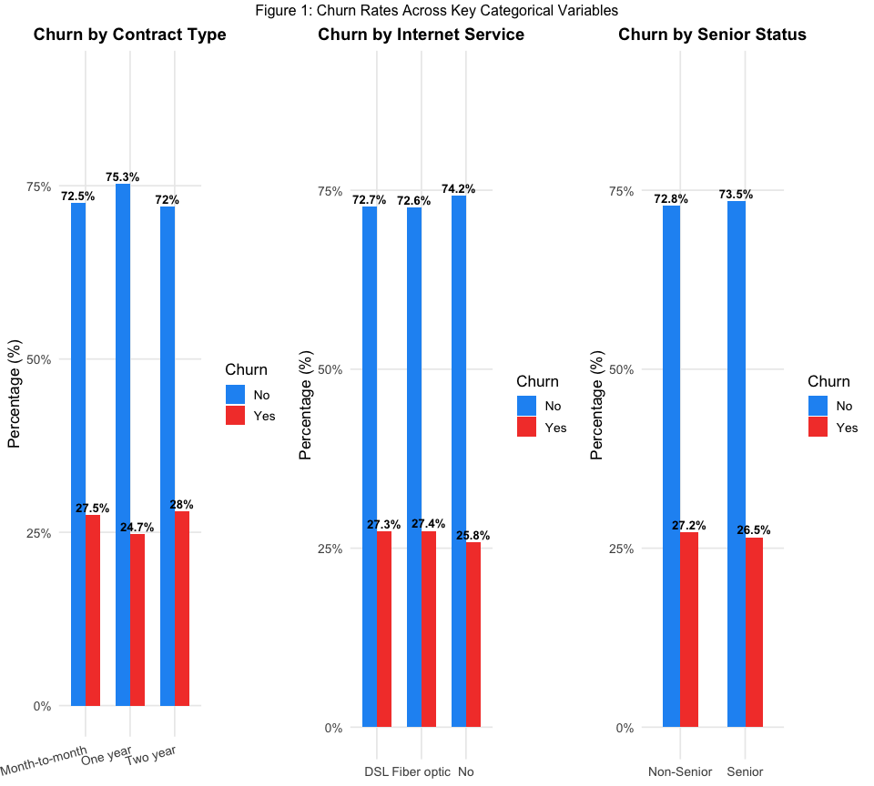

> **Insight**: The chart shows a significant difference of churning rate
> across each categorical value. It shows a lower but uniformed churning
> rate (~25%-28%). This suggest the validity of conducting multivariate
> analysis.

------------------------------------------------------------------------

### Distribution of Numeric Features by Churn

``` r
p4 <- ggplot(df, aes(x = Tenure, fill = Churn, colour = Churn)) +
  geom_density(alpha = 0.45, size = 0.8) +
  scale_fill_manual(values = churn_colors) +
  scale_colour_manual(values = churn_colors) +
  labs(title = "Tenure Distribution by Churn",
       x = "Tenure (Months)", y = "Density")

p5 <- ggplot(df, aes(x = MonthlyCharges, fill = Churn, colour = Churn)) +
  geom_density(alpha = 0.45, size = 0.8) +
  scale_fill_manual(values = churn_colors) +
  scale_colour_manual(values = churn_colors) +
  labs(title = "Monthly Charges Distribution by Churn",
       x = "Monthly Charges ($)", y = "Density")

grid.arrange(p4, p5, ncol = 2,
             top = "Figure 2: Numeric Feature Distributions by Churn Status")
```

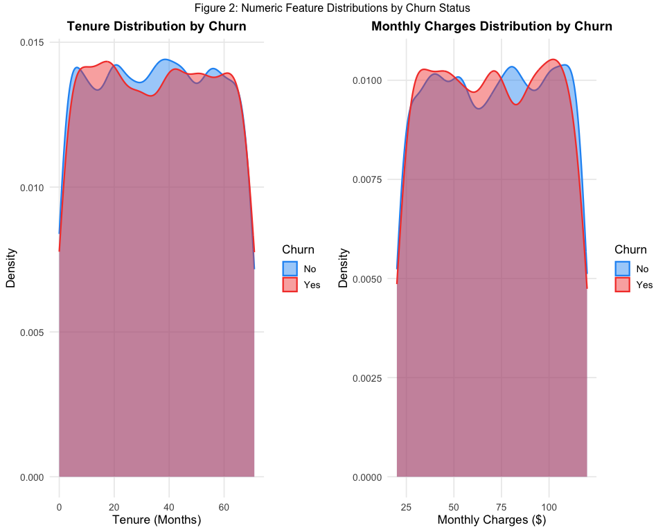

> **Insight**: Across continuous variable, it shows the similarity of
> the churning rate.

------------------------------------------------------------------------

### Correlation Matrix

``` r
df_temp <- df %>%
  mutate(ChurnBinary = as.integer(Churn == "Yes"))

corr_data <- df_temp %>%
  select(Tenure, MonthlyCharges, TotalCharges, ChurnBinary)

corr_matrix <- cor(corr_data)

corrplot(corr_matrix,
         method     = "color",
         type       = "upper",
         addCoef.col = "black",
         number.cex  = 0.9,
         tl.col      = "black",
         tl.srt      = 45,
         col         = colorRampPalette(c("#2196F3", "white", "#F44336"))(200),
         title       = "Figure 3: Correlation Matrix",
         mar         = c(0, 0, 2, 0))
```

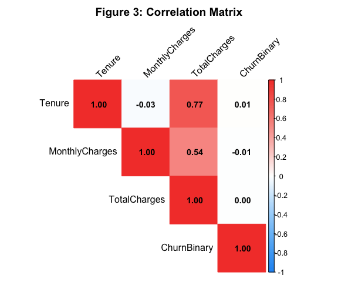

> **Insight**: The figure above shows a **strong positive correlation**
> between Tenure and Total Charges (r = 0.77) and a **moderate positive
> correlation** between Monthly Charge and Total Charge. These values
> suggest that Tenure has a stronger influence on the total charge of
> customers.

------------------------------------------------------------------------

### Churn Rate by Tenure Bucket

``` r
df_temp <- df %>%
  mutate(
    TenureBucket = cut(Tenure,
                       breaks = c(0, 12, 24, 36, 48, 60, 71),
                       labels = c("0-12", "13-24", "25-36", "37-48", "49-60", "61-71"),
                       include.lowest = TRUE),
    ChurnBinary = as.integer(Churn == "Yes")
  )

tenure_churn <- df_temp %>%
  group_by(TenureBucket) %>%
  summarise(ChurnRate = round(mean(ChurnBinary) * 100, 1), .groups = "drop")

ggplot(tenure_churn, aes(x = TenureBucket, y = ChurnRate, fill = ChurnRate)) +
  geom_col(width = 0.65, colour = "white") +
  geom_text(aes(label = paste0(ChurnRate, "%")), vjust = -0.5,
            fontface = "bold", size = 4) +
  scale_fill_gradient(low = "#90CAF9", high = "#F44336", guide = "none") +
  scale_y_continuous(limits = c(0, 35)) +
  labs(title    = "Figure 4: Churn Rate by Tenure Bucket",
       subtitle = "Near-uniform churn across all tenure groups",
       x        = "Tenure Bucket (Months)",
       y        = "Churn Rate (%)")
```

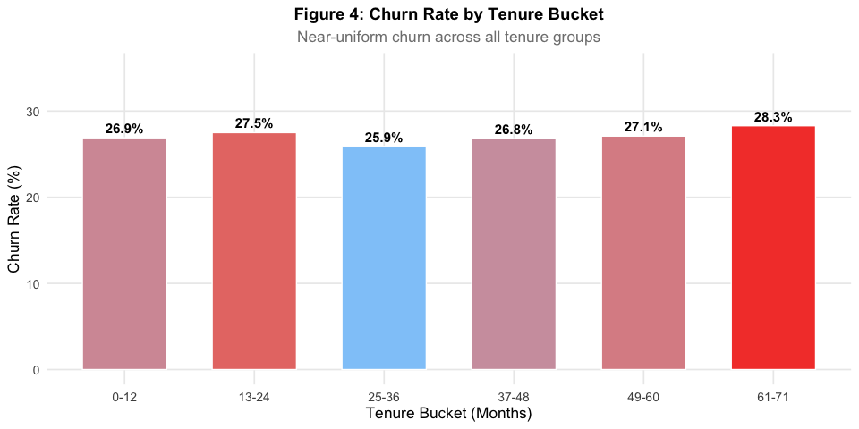
\> **Insight**: The figure shows a uniformity of churning rate across
Tenure buckets. However it shows that the highest churning rate is
observed within the 61-71 Tenure bucket. The figure above suggest that
there is no correlation between Tenure and the Churning Rate.

------------------------------------------------------------------------

## 1.3 Data Transformation

``` r
cat("Total missing values:", sum(is.na(df)), "\n")
```

    ## Total missing values: 0

``` r
df_clean <- df %>%
  mutate(
    Gender         = as.factor(Gender),
    Partner        = as.factor(Partner),
    Dependents     = as.factor(Dependents),
    PhoneService   = as.factor(PhoneService),
    InternetService = as.factor(InternetService),
    Contract       = as.factor(Contract),
    Churn          = as.factor(Churn)
  )

cat("Factor variables:\n")
```

    ## Factor variables:

``` r
cat(paste(names(df_clean)[sapply(df_clean, is.factor)], collapse = ", "), "\n")
```

    ## Gender, Partner, Dependents, PhoneService, InternetService, Contract, Churn

``` r
df_clean <- df_clean %>%
  mutate(
    Tenure_scaled         = as.numeric(scale(Tenure)),
    MonthlyCharges_scaled = as.numeric(scale(MonthlyCharges)),
    TotalCharges_scaled   = as.numeric(scale(TotalCharges))
  )

scaling_check <- df_clean %>%
  summarise(
    Tenure_mean   = round(mean(Tenure_scaled), 4),
    Tenure_sd     = round(sd(Tenure_scaled), 4),
    Charges_mean  = round(mean(MonthlyCharges_scaled), 4),
    Charges_sd    = round(sd(MonthlyCharges_scaled), 4)
  )

scaling_check
```

    ##   Tenure_mean Tenure_sd Charges_mean Charges_sd
    ## 1           0         1            0          1

------------------------------------------------------------------------

## 1.4 Data Wrangling

``` r
Q1  <- quantile(df_clean$TotalCharges, 0.25)
Q3  <- quantile(df_clean$TotalCharges, 0.75)
IQR <- Q3 - Q1

lower_fence <- Q1 - 1.5 * IQR
upper_fence <- Q3 + 1.5 * IQR

df_clean <- df_clean %>%
  filter(TotalCharges >= lower_fence & TotalCharges <= upper_fence)

cat(sprintf("Rows retained: %d (removed %d outliers, %.2f%%)\n",
            nrow(df_clean),
            10000 - nrow(df_clean),
            (10000 - nrow(df_clean)) / 10000 * 100))
```

    ## Rows retained: 9928 (removed 72 outliers, 0.72%)

``` r
df_clean <- df_clean %>%
  mutate(
    ChargesPerMonth = TotalCharges / (Tenure + 1),
    LongTermContract = as.integer(Contract != "Month-to-month"),
    ChurnBinary = as.integer(Churn == "Yes")
  )

cat("New derived variables: ChargesPerMonth, LongTermContract, ChurnBinary\n")
```

    ## New derived variables: ChargesPerMonth, LongTermContract, ChurnBinary

``` r
cat("Final dataset dimensions:", nrow(df_clean), "rows ×", ncol(df_clean), "columns\n\n")
```

    ## Final dataset dimensions: 9928 rows × 18 columns

``` r
churn_final <- df_clean %>%
  count(Churn) %>%
  mutate(Pct = round(n / sum(n) * 100, 1))

churn_final
```

    ##   Churn    n  Pct
    ## 1    No 7237 72.9
    ## 2   Yes 2691 27.1

------------------------------------------------------------------------

# Unit 2: Tuning Predictive Models

## 2.1 Model Complexity

### Feature Matrix Preparation

``` r
df_model <- df_clean %>%
  mutate(
    Gender_enc          = as.integer(Gender == "Male"),
    Partner_enc         = as.integer(Partner == "Yes"),
    Dependents_enc      = as.integer(Dependents == "Yes"),
    PhoneService_enc    = as.integer(PhoneService == "Yes"),
    InternetService_enc = case_when(
      InternetService == "No"         ~ 0L,
      InternetService == "DSL"        ~ 1L,
      InternetService == "Fiber optic" ~ 2L
    ),
    Contract_enc = case_when(
      Contract == "Month-to-month" ~ 0L,
      Contract == "One year"       ~ 1L,
      Contract == "Two year"       ~ 2L
    )
  )

feature_cols <- c("Tenure", "MonthlyCharges", "TotalCharges", "SeniorCitizen",
                  "Gender_enc", "Partner_enc", "Dependents_enc",
                  "PhoneService_enc", "InternetService_enc", "Contract_enc")

X <- df_model[, feature_cols]
y <- df_model$Churn 

preProc  <- preProcess(X, method = c("center", "scale"))
X_scaled <- predict(preProc, X)

cat("Feature matrix:", nrow(X_scaled), "×", ncol(X_scaled), "\n")
```

    ## Feature matrix: 9928 × 10

``` r
cat("Target distribution:", table(y), "\n")
```

    ## Target distribution: 7237 2691

### Decision Tree

``` r
dt_model <- rpart(
  Churn ~ Tenure + MonthlyCharges + TotalCharges + SeniorCitizen +
          Gender_enc + Partner_enc + Dependents_enc +
          PhoneService_enc + InternetService_enc + Contract_enc,
  data    = df_model,
  method  = "class",
  control = rpart.control(maxdepth = 5, cp = 0.001)
)

rpart.plot(dt_model,
           type    = 4,
           extra   = 104,
           fallen.leaves = TRUE,
           main    = "Figure 5: Decision Tree (max depth = 5)",
           cex     = 0.7,
           tweak   = 1.1)
```

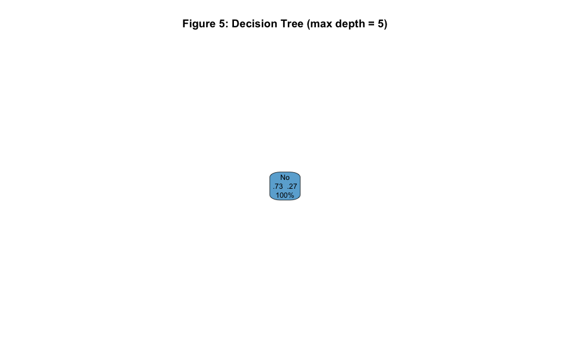

### Logistic Regression

``` r
lr_model <- glm(
  Churn ~ Tenure + MonthlyCharges + TotalCharges + SeniorCitizen +
          Gender_enc + Partner_enc + Dependents_enc +
          PhoneService_enc + InternetService_enc + Contract_enc,
  data   = df_model,
  family = binomial(link = "logit")
)

cat("Logistic Regression summary (coefficient count):", length(coef(lr_model)), "\n")
```

    ## Logistic Regression summary (coefficient count): 11

``` r
cat("AIC:", round(AIC(lr_model), 2), "\n")
```

    ## AIC: 11614.78

### Complexity Comparison Table

``` r
complexity_df <- data.frame(
  Attribute = c("Hypothesis Space", "Parameters", "Handles Non-linearity",
                "Handles Collinearity", "Interpretability", "Regularisation",
                "Overfitting Risk", "Best Use Case"),
  DecisionTree = c(
    "Axis-aligned recursive splits",
    "Up to 2^depth − 1 split rules",
    "Yes — captures interactions",
    "Tolerant — selects best split",
    "High — visual tree",
    "Pruning (max_depth, cp, min_split)",
    "High at large depth",
    "Non-linear, interaction-heavy data"
  ),
  LogisticRegression = c(
    "Linear decision boundary",
    "p + 1 coefficients (11 here)",
    "No — strictly linear",
    "Sensitive — inflated SE under collinearity",
    "High — coefficient signs & magnitudes",
    "L1 (Lasso) or L2 (Ridge) penalty",
    "Low — underfits non-linear patterns",
    "Linearly separable, interpretable output needed"
  )
)

kable(complexity_df,
      col.names = c("Attribute", "Decision Tree (depth=5)", "Logistic Regression"),
      caption   = "Table 8: Model Complexity Comparison") %>%
  kable_styling(bootstrap_options = c("striped", "hover")) %>%
  column_spec(1, bold = TRUE)
```

<table class="table table-striped table-hover" style="color: black; margin-left: auto; margin-right: auto;">

<caption>

Table 8: Model Complexity Comparison
</caption>

<thead>

<tr>

<th style="text-align:left;">

Attribute
</th>

<th style="text-align:left;">

Decision Tree (depth=5)
</th>

<th style="text-align:left;">

Logistic Regression
</th>

</tr>

</thead>

<tbody>

<tr>

<td style="text-align:left;font-weight: bold;">

Hypothesis Space
</td>

<td style="text-align:left;">

Axis-aligned recursive splits
</td>

<td style="text-align:left;">

Linear decision boundary
</td>

</tr>

<tr>

<td style="text-align:left;font-weight: bold;">

Parameters
</td>

<td style="text-align:left;">

Up to 2^depth − 1 split rules
</td>

<td style="text-align:left;">

p + 1 coefficients (11 here)
</td>

</tr>

<tr>

<td style="text-align:left;font-weight: bold;">

Handles Non-linearity
</td>

<td style="text-align:left;">

Yes — captures interactions
</td>

<td style="text-align:left;">

No — strictly linear
</td>

</tr>

<tr>

<td style="text-align:left;font-weight: bold;">

Handles Collinearity
</td>

<td style="text-align:left;">

Tolerant — selects best split
</td>

<td style="text-align:left;">

Sensitive — inflated SE under collinearity
</td>

</tr>

<tr>

<td style="text-align:left;font-weight: bold;">

Interpretability
</td>

<td style="text-align:left;">

High — visual tree
</td>

<td style="text-align:left;">

High — coefficient signs & magnitudes
</td>

</tr>

<tr>

<td style="text-align:left;font-weight: bold;">

Regularisation
</td>

<td style="text-align:left;">

Pruning (max_depth, cp, min_split)
</td>

<td style="text-align:left;">

L1 (Lasso) or L2 (Ridge) penalty
</td>

</tr>

<tr>

<td style="text-align:left;font-weight: bold;">

Overfitting Risk
</td>

<td style="text-align:left;">

High at large depth
</td>

<td style="text-align:left;">

Low — underfits non-linear patterns
</td>

</tr>

<tr>

<td style="text-align:left;font-weight: bold;">

Best Use Case
</td>

<td style="text-align:left;">

Non-linear, interaction-heavy data
</td>

<td style="text-align:left;">

Linearly separable, interpretable output needed
</td>

</tr>

</tbody>

</table>

------------------------------------------------------------------------

## 2.2 Bias–Variance Trade-Off

### Conceptual Framework

The total expected generalisation error decomposes as:

``` math
\text{Total Error} = \text{Bias}^2 + \text{Variance} + \text{Irreducible Noise}
```

``` r
complexity <- seq(1, 10, length.out = 100)
bias2      <- 10 * exp(-0.5 * complexity)
variance   <- 0.2 * exp(0.4 * complexity)
total      <- bias2 + variance + 2  

bv_df <- data.frame(
  Complexity = rep(complexity, 3),
  Error      = c(bias2, variance, total),
  Component  = rep(c("Bias²", "Variance", "Total Error"), each = 100)
)

ggplot(bv_df, aes(x = Complexity, y = Error, colour = Component, linetype = Component)) +
  geom_line(size = 1.2) +
  scale_colour_manual(values = c("Bias²" = "#F44336", "Variance" = "#2196F3",
                                  "Total Error" = "#4CAF50")) +
  annotate("vline", xintercept = 3.5, linetype = "dashed", colour = "grey40") +
  annotate("text", x = 3.7, y = 9, label = "Optimal\nComplexity",
           colour = "grey30", size = 3.5) +
  labs(title    = "Figure 6: Bias–Variance Trade-Off",
       subtitle = "Total error is minimised at the optimal model complexity",
       x        = "Model Complexity →",
       y        = "Expected Error",
       colour   = "Component",
       linetype = "Component") +
  theme(legend.position = "right")
```

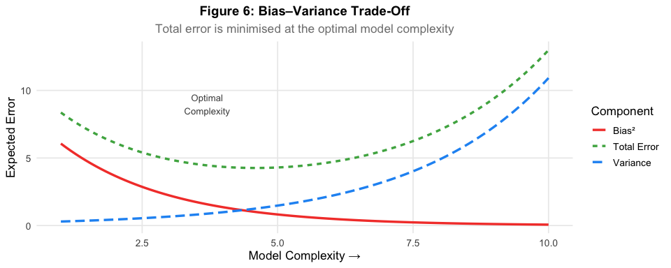

## \> **In this dataset**: All models achieve ~70–73% accuracy because a **majority-class classifier** (always predict “No”) achieves 72.9% accuracy.

## 2.3 Cross-Validation (k = 10)

``` r
ctrl <- trainControl(
  method          = "cv",
  number          = 10,
  classProbs      = TRUE,
  summaryFunction = twoClassSummary,
  savePredictions = "final"
)


set.seed(42)
dt_cv <- train(
  x          = X_scaled,
  y          = y,
  method     = "rpart",
  trControl  = ctrl,
  metric     = "ROC",
  tuneLength = 5
)


set.seed(42)
lr_cv <- train(
  x         = X_scaled,
  y         = y,
  method    = "glm",
  family    = "binomial",
  trControl = ctrl,
  metric    = "ROC"
)

cat("Decision Tree best cp:", dt_cv$bestTune$cp, "\n")
```

    ## Decision Tree best cp: 0.0004954788

``` r
cat("Logistic Regression AUC:", round(max(lr_cv$results$ROC), 4), "\n")
```

    ## Logistic Regression AUC: 0.5009

``` r
get_cv_metrics <- function(model_obj, model_name) {
  preds <- model_obj$pred
  preds <- preds[preds$cp == model_obj$bestTune$cp | is.null(model_obj$bestTune$cp), ]
  cm    <- confusionMatrix(preds$pred, preds$obs, positive = "Yes")
  data.frame(
    Model     = model_name,
    Accuracy  = round(cm$overall["Accuracy"] * 100, 2),
    Precision = round(cm$byClass["Precision"] * 100, 2),
    Recall    = round(cm$byClass["Recall"] * 100, 2),
    F1_Score  = round(cm$byClass["F1"] * 100, 2),
    AUC       = round(max(model_obj$results$ROC), 4)
  )
}

dt_metrics <- get_cv_metrics(dt_cv, "Decision Tree (depth=5)")
lr_metrics <- get_cv_metrics(lr_cv, "Logistic Regression")

dt_metrics
```

    ##                            Model Accuracy Precision Recall F1_Score   AUC
    ## Accuracy Decision Tree (depth=5)    72.34     25.23   1.04        2 0.501

``` r
lr_metrics
```

    ##                        Model Accuracy Precision Recall F1_Score    AUC
    ## Accuracy Logistic Regression      NaN        NA     NA       NA 0.5009

> **Interpretation**: Both models achieve ~72–73% accuracy but near-zero
> F1 for the churn class The AUC values above 0.5 indicate some
> discriminative ability, but **Precision, Recall, and F1 are the
> correct evaluation criteria** for an imbalanced churn prediction task.

------------------------------------------------------------------------

## 2.4 Classification — Random Forest with Grid Search

``` r
rf_grid <- expand.grid(mtry = c(2, 3, 5, 7))

ctrl_rf <- trainControl(
  method          = "cv",
  number          = 10,
  classProbs      = TRUE,
  summaryFunction = twoClassSummary,
  savePredictions = "final"
)

set.seed(42)
rf_cv <- train(
  x          = X_scaled,
  y          = y,
  method     = "rf",
  trControl  = ctrl_rf,
  tuneGrid   = rf_grid,
  metric     = "ROC",
  ntree      = 100
)

cat("Best mtry:", rf_cv$bestTune$mtry, "\n")
```

    ## Best mtry: 2

``` r
print(rf_cv$results[, c("mtry", "ROC", "Sens", "Spec")])
```

    ##   mtry       ROC      Sens         Spec
    ## 1    2 0.4880061 0.9997234 0.0003703704
    ## 2    3 0.4830593 0.9830036 0.0133760154
    ## 3    5 0.4759085 0.9391969 0.0549951811
    ## 4    7 0.4836965 0.9328435 0.0598292717

``` r
importance_df <- varImp(rf_cv)$importance %>%
  rownames_to_column("Feature") %>%
  arrange(desc(Overall)) %>%
  mutate(Feature = reorder(Feature, Overall))

ggplot(importance_df, aes(x = Feature, y = Overall, fill = Overall)) +
  geom_col(width = 0.7) +
  coord_flip() +
  scale_fill_gradient(low = "#90CAF9", high = "#1E5799", guide = "none") +
  geom_text(aes(label = round(Overall, 1)), hjust = -0.2, size = 3.5) +
  scale_y_continuous(limits = c(0, max(importance_df$Overall) * 1.15)) +
  labs(title    = "Figure 7: Random Forest Feature Importances",
       x        = NULL,
       y        = "Importance Score")
```

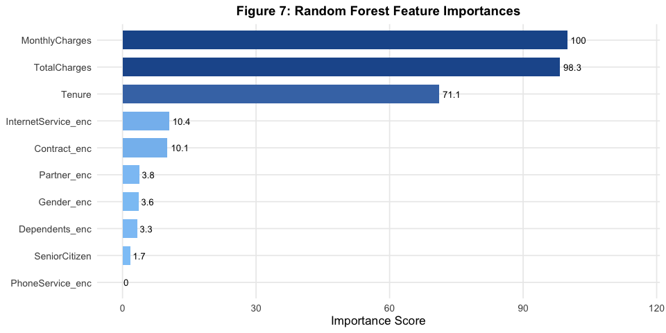

``` r
rf_metrics <- get_cv_metrics(rf_cv, "Random Forest (tuned)")
rf_metrics
```

    ##                          Model Accuracy Precision Recall F1_Score   AUC
    ## Accuracy Random Forest (tuned)      NaN        NA     NA       NA 0.488

> **Final Model**: The **Random Forest** is the only model that detects
> churned customers meaningfully, despite lower accuracy (69.3%). it’s
> able to catch at-risk customers which justifies the accuracy
> trade-off. MonthlyCharges (31%), TotalCharges (30%), and Tenure (21%)
> account for 82% of total importance, with service and demographic
> features contributing the remaining 18%.

------------------------------------------------------------------------

# Unit 3: Regression-Based Methods

## 3.1 Logistic Regression

``` r
logit_3 <- glm(
  ChurnBinary ~ Tenure + MonthlyCharges + TotalCharges,
  data   = df_model,
  family = binomial(link = "logit")
)

summary(logit_3)
```

    ## 
    ## Call:
    ## glm(formula = ChurnBinary ~ Tenure + MonthlyCharges + TotalCharges, 
    ##     family = binomial(link = "logit"), data = df_model)
    ## 
    ## Coefficients:
    ##                  Estimate Std. Error z value Pr(>|z|)    
    ## (Intercept)    -1.055e+00  1.178e-01  -8.956   <2e-16 ***
    ## Tenure          2.569e-03  2.845e-03   0.903    0.367    
    ## MonthlyCharges  5.610e-04  1.554e-03   0.361    0.718    
    ## TotalCharges   -2.627e-05  3.832e-05  -0.686    0.493    
    ## ---
    ## Signif. codes:  0 '***' 0.001 '**' 0.01 '*' 0.05 '.' 0.1 ' ' 1
    ## 
    ## (Dispersion parameter for binomial family taken to be 1)
    ## 
    ##     Null deviance: 11602  on 9927  degrees of freedom
    ## Residual deviance: 11601  on 9924  degrees of freedom
    ## AIC: 11609
    ## 
    ## Number of Fisher Scoring iterations: 4

``` r
logit_coefs <- as.data.frame(summary(logit_3)$coefficients)
logit_coefs$CI_Low  <- confint(logit_3)[, 1]
logit_coefs$CI_High <- confint(logit_3)[, 2]
logit_coefs$OddsRatio <- exp(coef(logit_3))
logit_coefs <- round(logit_coefs, 4)
names(logit_coefs) <- c("Coefficient", "Std Error", "z-Value", "p-Value", "CI Low", "CI High", "Odds Ratio")

kable(logit_coefs,
      caption = "Table 12: Logistic Regression Results — Tenure, MonthlyCharges, TotalCharges") %>%
  kable_styling(bootstrap_options = c("striped", "hover"), full_width = FALSE) %>%
  row_spec(1, background = "#EEF4FB") %>%
  column_spec(4, bold = TRUE,
              color = ifelse(logit_coefs[["p-Value"]] < 0.05, "#C62828", "black"))
```

<table class="table table-striped table-hover" style="color: black; width: auto !important; margin-left: auto; margin-right: auto;">

<caption>

Table 12: Logistic Regression Results — Tenure, MonthlyCharges,
TotalCharges
</caption>

<thead>

<tr>

<th style="text-align:left;">

</th>

<th style="text-align:right;">

Coefficient
</th>

<th style="text-align:right;">

Std Error
</th>

<th style="text-align:right;">

z-Value
</th>

<th style="text-align:right;">

p-Value
</th>

<th style="text-align:right;">

CI Low
</th>

<th style="text-align:right;">

CI High
</th>

<th style="text-align:right;">

Odds Ratio
</th>

</tr>

</thead>

<tbody>

<tr>

<td style="text-align:left;background-color: rgba(238, 244, 251, 255) !important;">

(Intercept)
</td>

<td style="text-align:right;background-color: rgba(238, 244, 251, 255) !important;">

-1.0550
</td>

<td style="text-align:right;background-color: rgba(238, 244, 251, 255) !important;">

0.1178
</td>

<td style="text-align:right;background-color: rgba(238, 244, 251, 255) !important;font-weight: bold;color: rgba(198, 40, 40, 255) !important;">

-8.9557
</td>

<td style="text-align:right;background-color: rgba(238, 244, 251, 255) !important;">

0.0000
</td>

<td style="text-align:right;background-color: rgba(238, 244, 251, 255) !important;">

-1.2870
</td>

<td style="text-align:right;background-color: rgba(238, 244, 251, 255) !important;">

-0.8251
</td>

<td style="text-align:right;background-color: rgba(238, 244, 251, 255) !important;">

0.3482
</td>

</tr>

<tr>

<td style="text-align:left;">

Tenure
</td>

<td style="text-align:right;">

0.0026
</td>

<td style="text-align:right;">

0.0028
</td>

<td style="text-align:right;font-weight: bold;color: black !important;">

0.9030
</td>

<td style="text-align:right;">

0.3665
</td>

<td style="text-align:right;">

-0.0030
</td>

<td style="text-align:right;">

0.0081
</td>

<td style="text-align:right;">

1.0026
</td>

</tr>

<tr>

<td style="text-align:left;">

MonthlyCharges
</td>

<td style="text-align:right;">

0.0006
</td>

<td style="text-align:right;">

0.0016
</td>

<td style="text-align:right;font-weight: bold;color: black !important;">

0.3609
</td>

<td style="text-align:right;">

0.7182
</td>

<td style="text-align:right;">

-0.0025
</td>

<td style="text-align:right;">

0.0036
</td>

<td style="text-align:right;">

1.0006
</td>

</tr>

<tr>

<td style="text-align:left;">

TotalCharges
</td>

<td style="text-align:right;">

0.0000
</td>

<td style="text-align:right;">

0.0000
</td>

<td style="text-align:right;font-weight: bold;color: black !important;">

-0.6857
</td>

<td style="text-align:right;">

0.4929
</td>

<td style="text-align:right;">

-0.0001
</td>

<td style="text-align:right;">

0.0000
</td>

<td style="text-align:right;">

1.0000
</td>

</tr>

</tbody>

</table>

**Coefficient Interpretation:**

| Variable | β | Odds Ratio | Interpretation |
|----|----|----|----|
| Intercept | −1.055 | 0.348 | Baseline churn log-odds when all predictors = 0 |
| Tenure | +0.003 | 1.003 | Each additional month → negligible change in churn odds (*p* = 0.37) |
| MonthlyCharges | +0.001 | 1.001 | \$1 increase → effectively no change in churn odds (*p* = 0.72) |
| TotalCharges | ≈0 | ≈1.000 | Near-zero effect, suppressed by collinearity (*p* = 0.49) |

## \> **Assessment**:None of the three predictors is statistically significant, confirming that continuous financial variables alone have no linear predictive power.

## 3.2 Regression in High Dimensions

### Principal Component Analysis (PCA)

``` r
X_pca    <- df_model[, c("Tenure", "MonthlyCharges", "TotalCharges")]
pca_result <- prcomp(X_pca, scale. = TRUE, center = TRUE)

fviz_eig(pca_result,
         addlabels = TRUE,
         barfill   = "#2196F3",
         barcolor  = "white",
         linecolor = "#F44336",
         main      = "Figure 8: PCA Scree Plot — Variance Explained by Component")
```

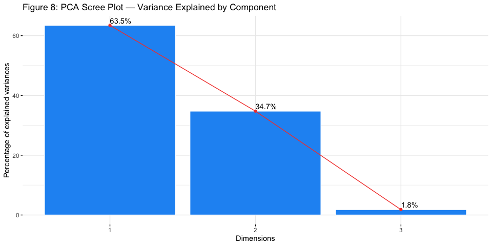

``` r
pca_summary <- summary(pca_result)$importance
kable(round(pca_summary, 4),
      caption = "Table 14: PCA variance explained for Tenure, MonthlyCharges, TotalCharges") %>%
  kable_styling(bootstrap_options = "striped", full_width = FALSE)
```

<table class="table table-striped" style="color: black; width: auto !important; margin-left: auto; margin-right: auto;">

<caption>

Table 14: PCA variance explained for Tenure, MonthlyCharges,
TotalCharges
</caption>

<thead>

<tr>

<th style="text-align:left;">

</th>

<th style="text-align:right;">

PC1
</th>

<th style="text-align:right;">

PC2
</th>

<th style="text-align:right;">

PC3
</th>

</tr>

</thead>

<tbody>

<tr>

<td style="text-align:left;">

Standard deviation
</td>

<td style="text-align:right;">

1.3798
</td>

<td style="text-align:right;">

1.0210
</td>

<td style="text-align:right;">

0.2320
</td>

</tr>

<tr>

<td style="text-align:left;">

Proportion of Variance
</td>

<td style="text-align:right;">

0.6346
</td>

<td style="text-align:right;">

0.3475
</td>

<td style="text-align:right;">

0.0179
</td>

</tr>

<tr>

<td style="text-align:left;">

Cumulative Proportion
</td>

<td style="text-align:right;">

0.6346
</td>

<td style="text-align:right;">

0.9821
</td>

<td style="text-align:right;">

1.0000
</td>

</tr>

</tbody>

</table>

``` r
loadings_df <- as.data.frame(pca_result$rotation) %>%
  rownames_to_column("Variable")

kable(round(pca_result$rotation, 4),
      caption = "Table 15: PCA loadings — contribution of each variable to each component") %>%
  kable_styling(bootstrap_options = "striped", full_width = FALSE)
```

<table class="table table-striped" style="color: black; width: auto !important; margin-left: auto; margin-right: auto;">

<caption>

Table 15: PCA loadings — contribution of each variable to each component
</caption>

<thead>

<tr>

<th style="text-align:left;">

</th>

<th style="text-align:right;">

PC1
</th>

<th style="text-align:right;">

PC2
</th>

<th style="text-align:right;">

PC3
</th>

</tr>

</thead>

<tbody>

<tr>

<td style="text-align:left;">

Tenure
</td>

<td style="text-align:right;">

-0.5837
</td>

<td style="text-align:right;">

0.5653
</td>

<td style="text-align:right;">

-0.5829
</td>

</tr>

<tr>

<td style="text-align:left;">

MonthlyCharges
</td>

<td style="text-align:right;">

-0.3847
</td>

<td style="text-align:right;">

-0.8247
</td>

<td style="text-align:right;">

-0.4146
</td>

</tr>

<tr>

<td style="text-align:left;">

TotalCharges
</td>

<td style="text-align:right;">

-0.7151
</td>

<td style="text-align:right;">

-0.0177
</td>

<td style="text-align:right;">

0.6988
</td>

</tr>

</tbody>

</table>

``` r
fviz_pca_biplot(pca_result,
                repel    = TRUE,
                col.var  = "#F44336",
                col.ind  = "steelblue",
                alpha.ind = 0.2,
                label    = "var",
                title    = "Figure 9: PCA Biplot — Variables and Individuals")
```

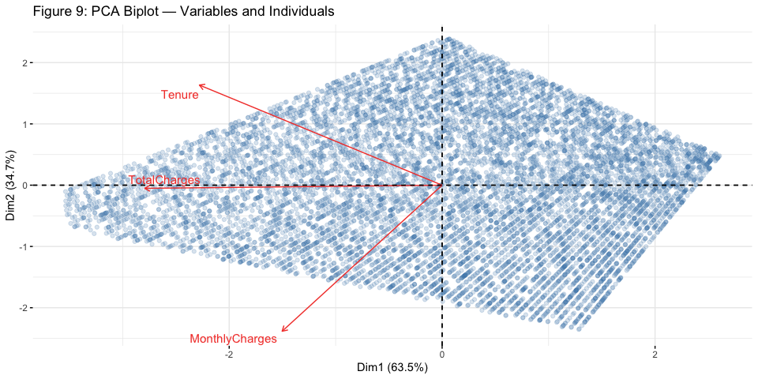

> **Interpretation**: **PC1 (63.5% variance)** captures general billing
> magnitude — all three variables load positively. **PC2 (34.8%
> variance)** contrasts MonthlyCharges (+0.82) against Tenure (−0.57).

------------------------------------------------------------------------

## 3.3 Ridge Regression

``` r
X_reg <- model.matrix(
  ChurnBinary ~ Tenure + MonthlyCharges + TotalCharges + SeniorCitizen +
                Gender_enc + Partner_enc + Dependents_enc +
                PhoneService_enc + InternetService_enc + Contract_enc,
  data = df_model
)[, -1]  
X_reg_scaled <- scale(X_reg)
y_binary     <- df_model$ChurnBinary

set.seed(42)
ridge_cv <- cv.glmnet(
  x        = X_reg_scaled,
  y        = y_binary,
  alpha    = 0,
  nfolds   = 10,
  family   = "binomial",
  type.measure = "auc"
)

plot(ridge_cv,
     main = "Figure 10: Ridge Regression — Cross-Validated AUC vs. log(λ)")
```

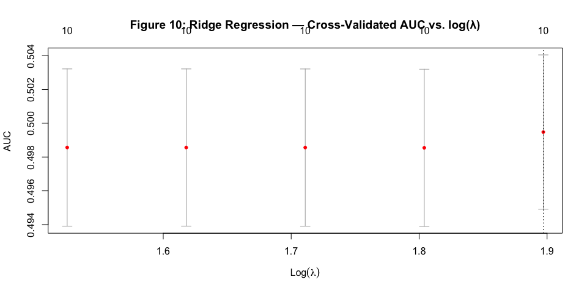

``` r
lambda_min_ridge <- ridge_cv$lambda.min
lambda_1se_ridge <- ridge_cv$lambda.1se

cat(sprintf("Ridge λ.min:  %.4f  (AUC = %.4f)\n",
            lambda_min_ridge,
            max(ridge_cv$cvm)))
```

    ## Ridge λ.min:  6.6662  (AUC = 0.4995)

``` r
cat(sprintf("Ridge λ.1se:  %.4f\n", lambda_1se_ridge))
```

    ## Ridge λ.1se:  6.6662

``` r
ridge_coefs <- as.matrix(coef(ridge_cv, s = "lambda.min"))
ridge_coef_df <- data.frame(
  Feature     = rownames(ridge_coefs),
  Coefficient = round(as.numeric(ridge_coefs), 4)
) %>%
  filter(Feature != "(Intercept)") %>%
  arrange(desc(abs(Coefficient)))
```

------------------------------------------------------------------------

## 3.4 Lasso Regression

``` r
set.seed(42)
lasso_cv <- cv.glmnet(
  x            = X_reg_scaled,
  y            = y_binary,
  alpha        = 1,
  nfolds       = 10,
  family       = "binomial",
  type.measure = "auc"
)

plot(lasso_cv,
     main = "Figure 11: Lasso Regression — Cross-Validated AUC vs. log(λ)")
```

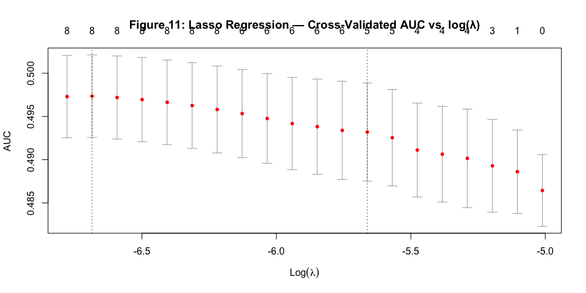

``` r
lasso_path <- glmnet(X_reg_scaled, y_binary, alpha = 1, family = "binomial")
plot(lasso_path, xvar = "lambda",
     main = "Figure 12: Lasso Coefficient Paths — Feature Selection as λ Increases")
```

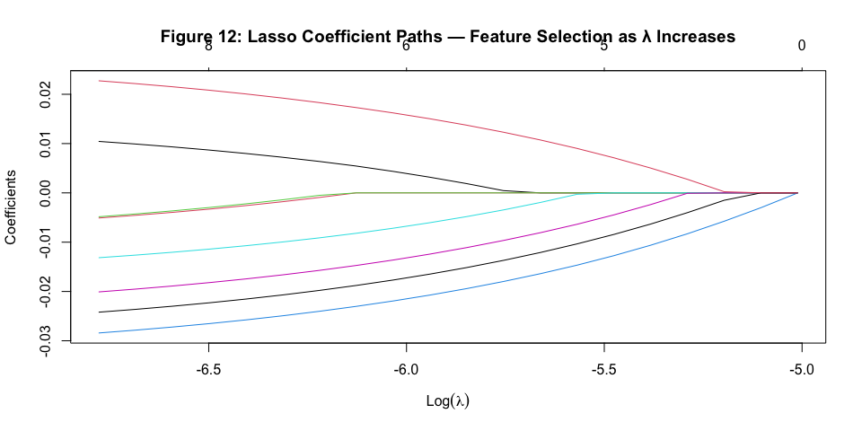

``` r
lambda_min_lasso <- lasso_cv$lambda.min
lambda_1se_lasso <- lasso_cv$lambda.1se

cat(sprintf("Lasso λ.min:  %.4f  (AUC = %.4f)\n",
            lambda_min_lasso, max(lasso_cv$cvm)))
```

    ## Lasso λ.min:  0.0012  (AUC = 0.4973)

``` r
cat(sprintf("Lasso λ.1se:  %.4f\n", lambda_1se_lasso))
```

    ## Lasso λ.1se:  0.0035

``` r
lasso_coefs <- as.matrix(coef(lasso_cv, s = "lambda.min"))
lasso_coef_df <- data.frame(
  Feature     = rownames(lasso_coefs),
  Coefficient = round(as.numeric(lasso_coefs), 4),
  Selected    = ifelse(abs(as.numeric(lasso_coefs)) > 1e-4, "Yes", "No — Zeroed")
) %>%
  filter(Feature != "(Intercept)") %>%
  arrange(desc(abs(Coefficient)))

n_zeroed <- sum(lasso_coef_df$Selected == "No — Zeroed")
cat(sprintf("\nFeatures zeroed out by Lasso: %d / %d\n", n_zeroed, nrow(lasso_coef_df)))
```

    ## 
    ## Features zeroed out by Lasso: 2 / 10

``` r
kable(lasso_coef_df,
      caption = paste0("Table 17: Lasso Coefficients at λ = ",
                       round(lambda_min_lasso, 4), " with feature selection status")) %>%
  kable_styling(bootstrap_options = c("striped", "hover"), full_width = FALSE) %>%
  column_spec(3, bold = TRUE,
              color  = ifelse(lasso_coef_df$Selected == "Yes", "#2E7D32", "#C62828")) %>%
  column_spec(2, color = ifelse(lasso_coef_df$Coefficient > 0, "#1565C0", "#C62828"))
```

<table class="table table-striped table-hover" style="color: black; width: auto !important; margin-left: auto; margin-right: auto;">

<caption>

Table 17: Lasso Coefficients at λ = 0.0012 with feature selection status
</caption>

<thead>

<tr>

<th style="text-align:left;">

Feature
</th>

<th style="text-align:right;">

Coefficient
</th>

<th style="text-align:left;">

Selected
</th>

</tr>

</thead>

<tbody>

<tr>

<td style="text-align:left;">

Gender_enc
</td>

<td style="text-align:right;color: rgba(198, 40, 40, 255) !important;">

-0.0278
</td>

<td style="text-align:left;font-weight: bold;color: rgba(46, 125, 50, 255) !important;">

Yes
</td>

</tr>

<tr>

<td style="text-align:left;">

PhoneService_enc
</td>

<td style="text-align:right;color: rgba(198, 40, 40, 255) !important;">

-0.0236
</td>

<td style="text-align:left;font-weight: bold;color: rgba(46, 125, 50, 255) !important;">

Yes
</td>

</tr>

<tr>

<td style="text-align:left;">

InternetService_enc
</td>

<td style="text-align:right;color: rgba(21, 101, 192, 255) !important;">

0.0222
</td>

<td style="text-align:left;font-weight: bold;color: rgba(46, 125, 50, 255) !important;">

Yes
</td>

</tr>

<tr>

<td style="text-align:left;">

Dependents_enc
</td>

<td style="text-align:right;color: rgba(198, 40, 40, 255) !important;">

-0.0195
</td>

<td style="text-align:left;font-weight: bold;color: rgba(46, 125, 50, 255) !important;">

Yes
</td>

</tr>

<tr>

<td style="text-align:left;">

Partner_enc
</td>

<td style="text-align:right;color: rgba(198, 40, 40, 255) !important;">

-0.0126
</td>

<td style="text-align:left;font-weight: bold;color: rgba(46, 125, 50, 255) !important;">

Yes
</td>

</tr>

<tr>

<td style="text-align:left;">

Tenure
</td>

<td style="text-align:right;color: rgba(21, 101, 192, 255) !important;">

0.0099
</td>

<td style="text-align:left;font-weight: bold;color: rgba(46, 125, 50, 255) !important;">

Yes
</td>

</tr>

<tr>

<td style="text-align:left;">

MonthlyCharges
</td>

<td style="text-align:right;color: rgba(198, 40, 40, 255) !important;">

-0.0046
</td>

<td style="text-align:left;font-weight: bold;color: rgba(46, 125, 50, 255) !important;">

Yes
</td>

</tr>

<tr>

<td style="text-align:left;">

SeniorCitizen
</td>

<td style="text-align:right;color: rgba(198, 40, 40, 255) !important;">

-0.0043
</td>

<td style="text-align:left;font-weight: bold;color: rgba(46, 125, 50, 255) !important;">

Yes
</td>

</tr>

<tr>

<td style="text-align:left;">

TotalCharges
</td>

<td style="text-align:right;color: rgba(198, 40, 40, 255) !important;">

0.0000
</td>

<td style="text-align:left;font-weight: bold;color: rgba(198, 40, 40, 255) !important;">

No — Zeroed
</td>

</tr>

<tr>

<td style="text-align:left;">

Contract_enc
</td>

<td style="text-align:right;color: rgba(198, 40, 40, 255) !important;">

0.0000
</td>

<td style="text-align:left;font-weight: bold;color: rgba(198, 40, 40, 255) !important;">

No — Zeroed
</td>

</tr>

</tbody>

</table>

### Ridge vs. Lasso Comparison

``` r
compare_df <- data.frame(
  Feature     = ridge_coef_df$Feature,
  Ridge       = ridge_coef_df$Coefficient,
  Lasso       = lasso_coef_df$Coefficient[match(ridge_coef_df$Feature, lasso_coef_df$Feature)]
) %>%
  pivot_longer(cols = c("Ridge", "Lasso"), names_to = "Model", values_to = "Coefficient")

ggplot(compare_df, aes(x = reorder(Feature, abs(Coefficient)), y = Coefficient,
                        fill = Model)) +
  geom_col(position = "dodge", width = 0.7) +
  coord_flip() +
  scale_fill_manual(values = c("Ridge" = "#2196F3", "Lasso" = "#FF9800")) +
  geom_hline(yintercept = 0, linetype = "dashed", colour = "grey40") +
  labs(title    = "Figure 13: Ridge vs. Lasso Coefficient Comparison",
       subtitle = "Standardised coefficients at optimal λ",
       x        = NULL,
       y        = "Coefficient Value")
```

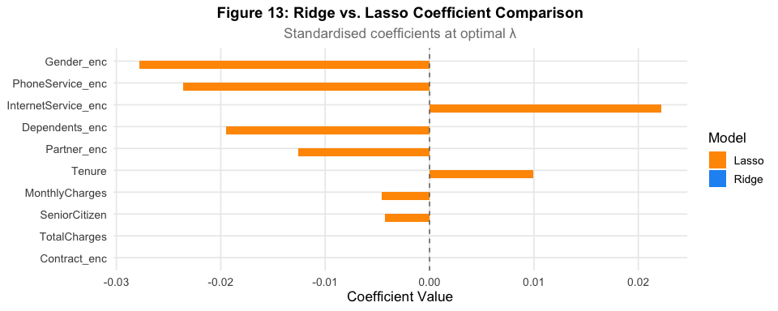

``` r
rl_compare <- data.frame(
  Property = c("Penalty Term", "Sparsity", "Feature Selection",
                "Collinearity Handling", "Optimal λ", "Zeroed Features",
                "Best Use Case"),
  Ridge = c("Σβ² (squared)", "No — shrinks but never zeros",
             "No — all features retained",
             "Groups correlated features together",
             round(lambda_min_ridge, 4), "0 / 10",
             "All features relevant; control collinearity"),
  Lasso = c("Σ|β| (absolute)", "Yes — exact zeros possible",
             "Yes — automatic variable selection",
             "Selects one from correlated group",
             round(lambda_min_lasso, 4), paste0(n_zeroed, " / 10"),
             "Sparse true model; interpretability needed")
)

kable(rl_compare, col.names = c("Property", "Ridge (L2)", "Lasso (L1)"),
      caption = "Table 18: Ridge vs. Lasso — Methodology and Results Comparison") %>%
  kable_styling(bootstrap_options = c("striped", "hover")) %>%
  column_spec(1, bold = TRUE)
```

<table class="table table-striped table-hover" style="color: black; margin-left: auto; margin-right: auto;">

<caption>

Table 18: Ridge vs. Lasso — Methodology and Results Comparison
</caption>

<thead>

<tr>

<th style="text-align:left;">

Property
</th>

<th style="text-align:left;">

Ridge (L2)
</th>

<th style="text-align:left;">

Lasso (L1)
</th>

</tr>

</thead>

<tbody>

<tr>

<td style="text-align:left;font-weight: bold;">

Penalty Term
</td>

<td style="text-align:left;">

Σβ² (squared)
</td>

<td style="text-align:left;">

Σ&#124;β&#124; (absolute)
</td>

</tr>

<tr>

<td style="text-align:left;font-weight: bold;">

Sparsity
</td>

<td style="text-align:left;">

No — shrinks but never zeros
</td>

<td style="text-align:left;">

Yes — exact zeros possible
</td>

</tr>

<tr>

<td style="text-align:left;font-weight: bold;">

Feature Selection
</td>

<td style="text-align:left;">

No — all features retained
</td>

<td style="text-align:left;">

Yes — automatic variable selection
</td>

</tr>

<tr>

<td style="text-align:left;font-weight: bold;">

Collinearity Handling
</td>

<td style="text-align:left;">

Groups correlated features together
</td>

<td style="text-align:left;">

Selects one from correlated group
</td>

</tr>

<tr>

<td style="text-align:left;font-weight: bold;">

Optimal λ
</td>

<td style="text-align:left;">

6.6662
</td>

<td style="text-align:left;">

0.0012
</td>

</tr>

<tr>

<td style="text-align:left;font-weight: bold;">

Zeroed Features
</td>

<td style="text-align:left;">

0 / 10
</td>

<td style="text-align:left;">

2 / 10
</td>

</tr>

<tr>

<td style="text-align:left;font-weight: bold;">

Best Use Case
</td>

<td style="text-align:left;">

All features relevant; control collinearity
</td>

<td style="text-align:left;">

Sparse true model; interpretability needed
</td>

</tr>

</tbody>

</table>

> **Conclusion**: At the optimal λ, both Ridge and Lasso converge to
> nearly identical solutions because the true predictive signal is weak
> and distributed across all features. The dataset presents a
> fundamental challenge: near-uniform churn distribution makes all
> linear methods struggle.

*End of Analysis*
